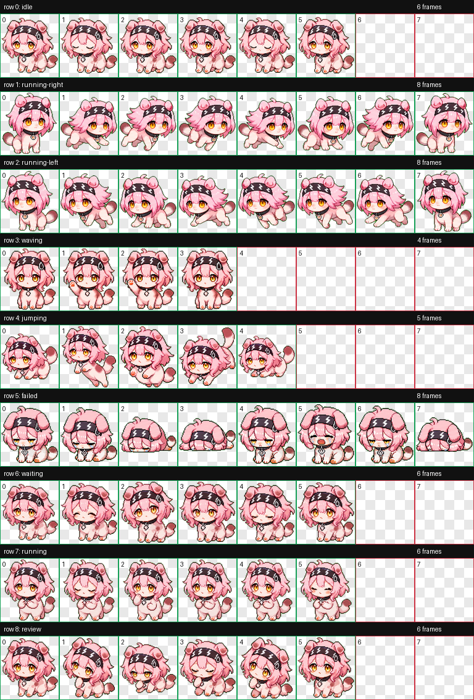

# Susie Paw

Susie Paw 是一个 Codex 自定义桌宠包：粉色电气猫猫风格，适合在 Codex 里作为轻量、可爱的工作状态陪伴。

> 非官方 fan-made 宠物包。该项目不隶属于、也不代表任何游戏或其权利方。

## 预览



## 安装

### 一键安装

在 macOS / Linux 终端执行：

```bash
PET_HOME="${CODEX_HOME:-$HOME/.codex}/pets/susie-paw"
mkdir -p "$PET_HOME"
curl -L "https://raw.githubusercontent.com/kkzhan201/susie_paw/main/pet.json" -o "$PET_HOME/pet.json"
curl -L "https://raw.githubusercontent.com/kkzhan201/susie_paw/main/spritesheet.webp" -o "$PET_HOME/spritesheet.webp"
```

然后重启 Codex，或重新打开宠物选择/设置面板。

### 手动安装

1. 下载本仓库的 `pet.json` 和 `spritesheet.webp`。
2. 新建目录：

```bash
mkdir -p "${CODEX_HOME:-$HOME/.codex}/pets/susie-paw"
```

3. 把两个文件放进去：

```text
${CODEX_HOME:-$HOME/.codex}/pets/susie-paw/
├── pet.json
└── spritesheet.webp
```

4. 重启 Codex。

## Codex Pet 格式

本仓库按 Codex custom pet 约定组织：

```text
pet.json
spritesheet.webp
preview/contact-sheet.png
```

`pet.json`：

```json
{
  "id": "susie-paw",
  "displayName": "Susie Paw",
  "description": "A tiny pink electric cat Codex pet with soft chibi energy.",
  "spritesheetPath": "spritesheet.webp"
}
```

`spritesheet.webp` 使用固定 atlas：

| 项目 | 值 |
| --- | --- |
| 尺寸 | `1536 x 1872` |
| 网格 | `8 x 9` |
| 单格 | `192 x 208` |
| 背景 | 透明 |
| 未使用格 | 全透明 |

动画行：

| Row | State | Frames |
| ---: | --- | ---: |
| 0 | `idle` | 6 |
| 1 | `running-right` | 8 |
| 2 | `running-left` | 8 |
| 3 | `waving` | 4 |
| 4 | `jumping` | 5 |
| 5 | `failed` | 8 |
| 6 | `waiting` | 6 |
| 7 | `running` | 6 |
| 8 | `review` | 6 |

## 卸载

```bash
rm -rf "${CODEX_HOME:-$HOME/.codex}/pets/susie-paw"
```

## 许可

README 和元数据可按 MIT 使用。`spritesheet.webp` 与 `preview/` 下的图片资产仅建议用于个人、学习和非商业用途；如需商业使用，请替换为你拥有完整权利的原创资产。
