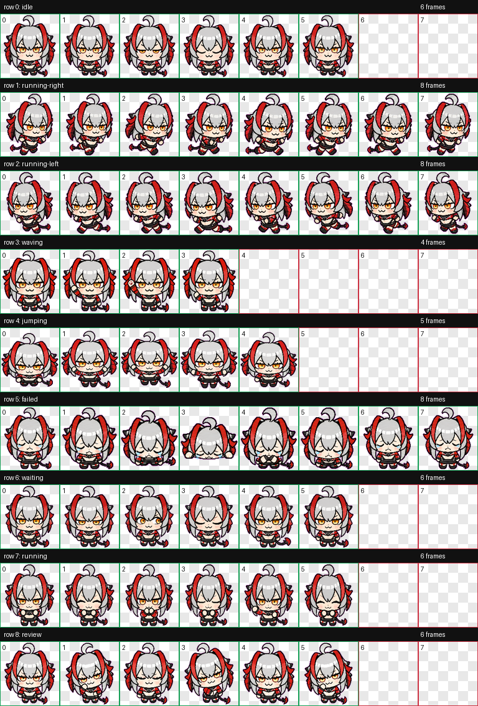

# W Paw

W Paw 是一个灰发、红黑配色、坏笑表情的 Codex 自定义桌宠。设计目标是把角色气质宠物化成大头、短手短脚、表情包感的小型桌面 mascot。

> 非官方 fan-made 宠物包。该项目不隶属于、也不代表任何游戏、发行方或权利方。

## 预览



视频预览：

- [running](preview/running.mp4)
- [failed](preview/failed.mp4)
- [review](preview/review.mp4)

## 安装

把 `<owner>` 替换成仓库所属账号后执行：

```bash
PET_HOME="${CODEX_HOME:-$HOME/.codex}/pets/w-paw"
REPO_RAW_BASE="https://raw.githubusercontent.com/<owner>/susie_paw/main"
mkdir -p "$PET_HOME"
curl -fL "$REPO_RAW_BASE/pets/w-paw/pet.json" -o "$PET_HOME/pet.json"
curl -fL "$REPO_RAW_BASE/pets/w-paw/spritesheet.webp" -o "$PET_HOME/spritesheet.webp"
```

然后重启 Codex，或重新打开宠物选择/设置面板。

## Manifest

```json
{
  "id": "w-paw",
  "displayName": "W Paw",
  "description": "A tiny grey-haired red-and-black mischievous chibi Codex pet.",
  "spritesheetPath": "spritesheet.webp"
}
```
